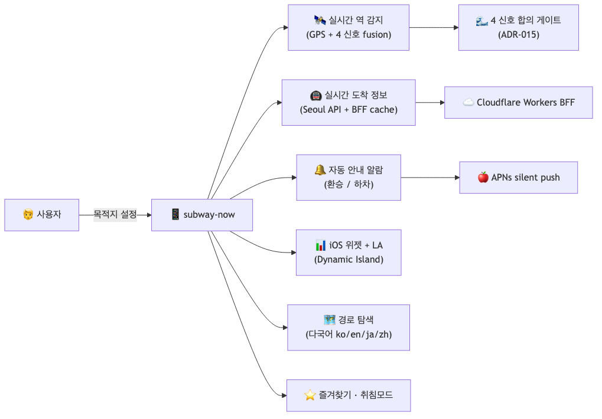
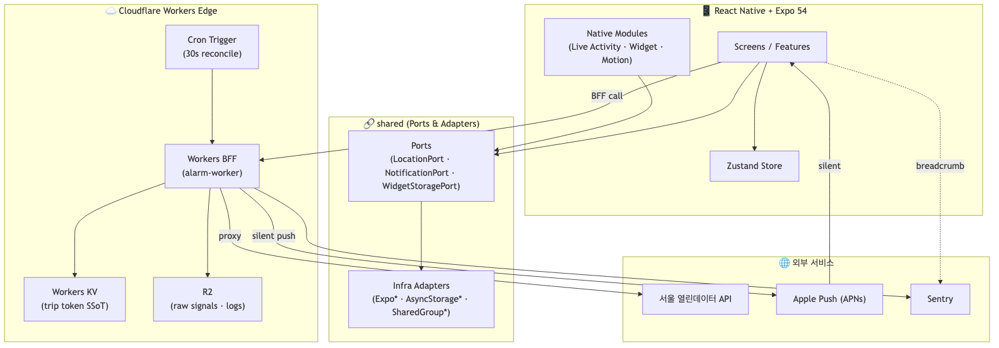
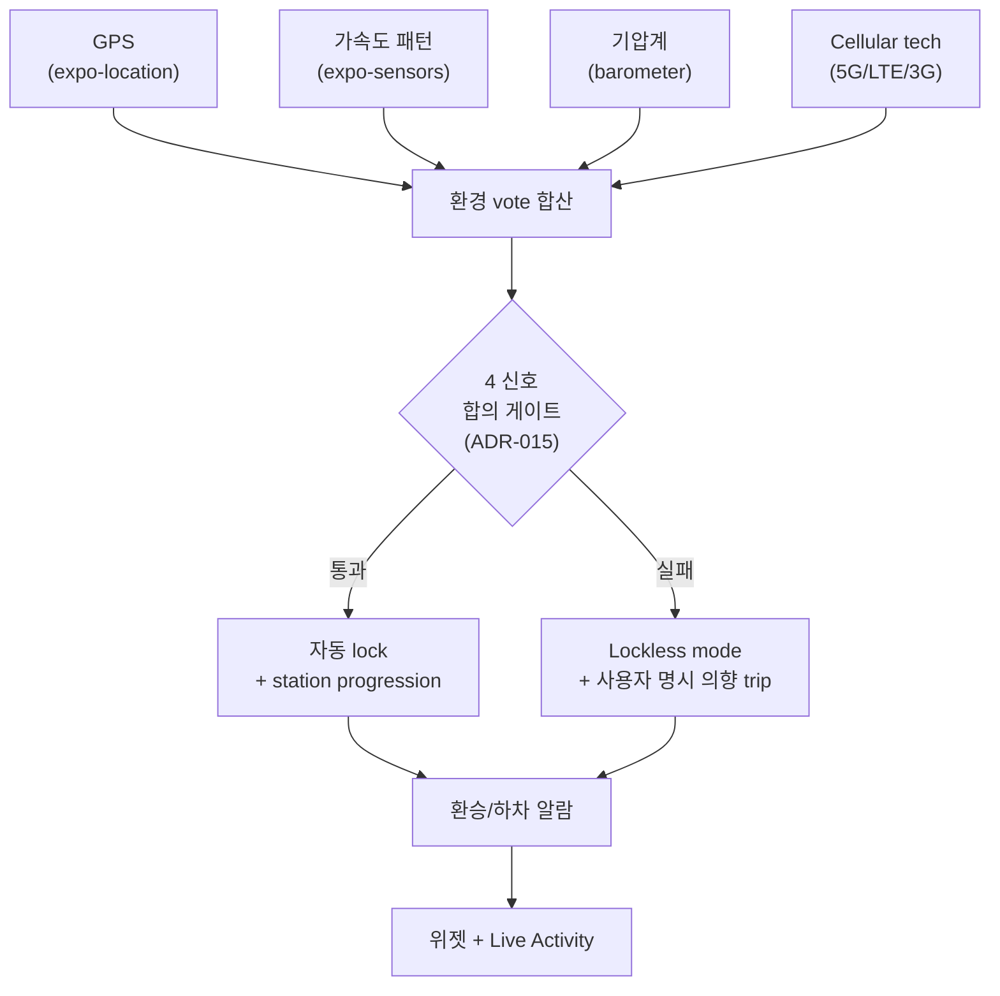
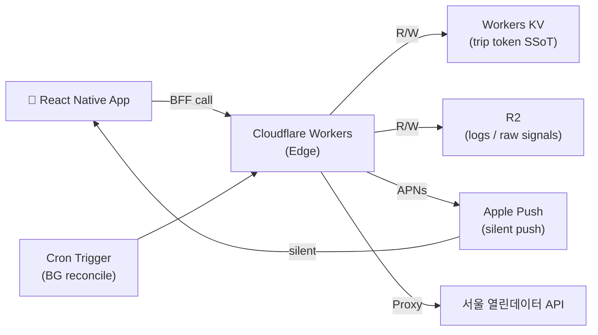
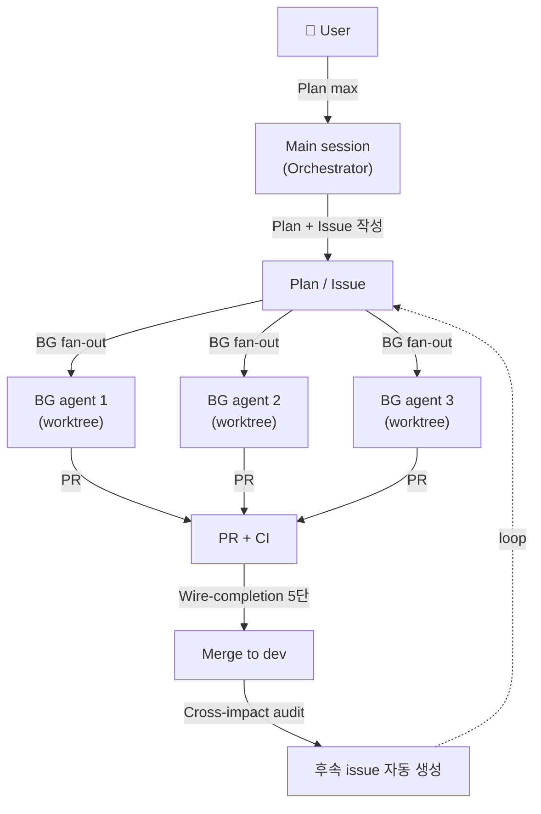
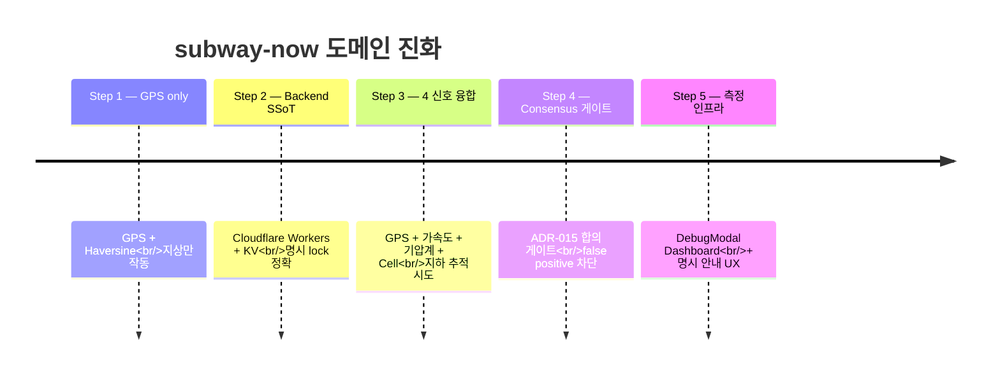

# 🚇 subway-now

## 🖥️ 프로젝트 소개

> **지하·터널·환승 환경에서도 끊기지 않는 지하철 자동 안내**가 필요합니다.
> 네이버·카카오 지도 앱은 출발 시점에만 경로를 안내하고, 지하철 안에서는 신호가 끊기는 순간 안내가 멈춥니다.
>
> subway-now는 **GPS·가속도·기압계·Cellular 4 신호를 융합**하여
> 통신이 닿지 않는 지하 환경에서도 현재 탑승 중인 역과 도착 정보를 실시간으로 추적합니다.
>
> 사용자가 한 번 안내를 시작하면, **자동으로 환승역·하차역에서 알람**이 울립니다.
>
> **이동은 단순하게, 안내는 정확하게.**

---

## 📜 목차

- [📌 핵심 기능](#-핵심-기능)
- [🗒️ 설계 문서](#️-설계-문서)
- [🔔 개발 규칙](#-개발-규칙)
- [🛠️ 기술스택](#️-기술스택)
- [📢 기술적 의사결정](#-기술적-의사결정)
- [📈 테스트 결과](#-테스트-결과)
- [🚩 트러블슈팅](#-트러블슈팅)
- [🤖 AI 협업 paradigm](#-ai-협업-paradigm)

---

## 📌 핵심 기능



<details>
<summary><b>실시간 역 감지 / Nearest Station</b></summary>

**기능**
- GPS 좌표 기반 500m 반경 내 최근접 역 자동 탐지
- 528개 서울 지하철역 좌표 (`stations.json`) 자체 DB 구축
- 30초 폴링 + Haversine 공식으로 거리 계산

**설명**
- `expo-location` + `expo-task-manager`로 FG/BG 모두 GPS 추적
- 지하철 노선·역 변경 시 데이터(JSON)만 갱신, 코드 무수정 (확장성)
- 지하/터널 환경에서는 GPS 단독으로 부정확 → 4 신호 융합으로 보완

</details>

<details>
<summary><b>4 신호 융합 fusion / Multi-Signal Fusion</b></summary>

**4가지 신호 소스**
1. **GPS** (`expo-location`) — 지상 환경 메인 신호
2. **가속도 패턴** (`expo-sensors`) — 정차/주행/감속 fingerprint
3. **기압계** (`barometer`) — 지하/지상 환경 판별 (지하는 기압이 높음)
4. **Cellular 기술** (`react-native-cellular-info`) — 5G/LTE/3G vote로 환경 추정

**설명**
- 단일 신호 단독 의존 시 false positive 빈발 → 4 신호 합의 게이트로 보완
- 합의 게이트 통과 시만 자동 lock + station progression
- 각 신호는 단독 결정 권한 X, vote 합산만 (ADR-015)

</details>

<details>
<summary><b>실시간 도착 정보 / Arrival Info</b></summary>

**기능**
- 서울 열린데이터 API를 통한 실시간 열차 도착 시간 표시
- Provider 패턴 (BFF/Direct/Mock) — 벤더 종속성 제거
- Cloudflare Workers BFF로 API 키 격리 + 응답 캐싱

**설명**
- 외부 API 제공자 변경 시 서버 파일 1개만 교체, 앱 재배포 불필요
- 30초 폴링 + TTL 캐시로 API 호출 최소화
- API 장애 시 silent fallback (마지막 정상 데이터 유지)

</details>

<details>
<summary><b>자동 안내 paradigm / Auto Navigation</b></summary>

**기능**
- 사용자가 "안내 시작" 한 번 누르면, 환승역·하차역까지 자동 알람
- BackgroundTask + Silent Push로 백그라운드에서도 동작
- WhileInUse 권한만으로도 작동 (Always 권한 강제 X)

**설명**
- 네이버/카카오는 출발 시점에만 안내. 지하 진입 후 안내 중단
- subway-now는 lockless 환경(지하)에서도 4 신호 융합으로 추적 지속
- 이동 중 환승 알림 / 하차 알림을 자동 발송 (사용자 매번 확인 불필요)

</details>

<details>
<summary><b>iOS 위젯 + Live Activity</b></summary>

**기능**
- 홈 화면 위젯: 현재 역 + 다음 도착 정보 1줄 표시
- Dynamic Island: 실시간 도착 카운트다운 (Live Activity)
- Lock Screen: 환승/하차 임박 시 자동 표시

**설명**
- App Groups + SharedGroupPreferences로 React Native ↔ Swift 위젯 데이터 공유
- `modules/live-activity/` 자체 네이티브 모듈 (expo-modules-core 기반)
- 위젯 데이터는 위치 변경 시점에만 업데이트 (배터리 최적화)

</details>

<details>
<summary><b>경로 탐색 & 환승 / Route & Transfer</b></summary>

**기능**
- 출발/도착역 입력 후 최적 경로 탐색
- 환승 횟수 표시 + 환승역 자동 알림
- 다국어 (한/영/일/중) 지원

**설명**
- `transfers` 배열을 순회로 처리 — 환승 횟수에 의존 X (확장성)
- 경로 데이터는 `lineGeometry.json` (OpenStreetMap 출처) 활용
- 4개 언어 i18n으로 외국인 관광객 접근성 보강

</details>

<details>
<summary><b>즐겨찾기 · 취침 모드 · 설정</b></summary>

**즐겨찾기**
- 자주 이용하는 역 저장 (AsyncStorage 영속화)
- Zustand 전역 상태 + 즉시 동기화

**취침 모드**
- 알람 사운드 + 진동 + 음성으로 도착 즉시 깨움
- 음성은 시스템 TTS (한국어/영어) 활용

**설정**
- 알람 사운드 토글 / 음성 알람 토글 / 다국어 / 다크 모드
- OS 다크 모드 자동 감지 (Editorial Light / C·Focus 테마)

</details>

---

## 🗒️ 설계 문서

| 문서 | 링크 |
|---|---|
| 아키텍처 | 아래 이미지 + Mermaid 다이어그램 참고 |
| ADR | [`docs/decisions/`](./docs/decisions/) — 결정 프로세스 룰 / 다중 신호 합의 게이트 / Backend Trip Position SSoT 등 |
| BFF 서버 | [subway-now-bff](https://github.com/handokei/subway-now-bff) — Cloudflare Workers (API 프록시 + 캐싱) |

**아키텍처**



### 4 신호 융합 cascade flow



### Cloudflare Workers Edge 아키텍처



### AI multi-agent orchestration



### 데이터 흐름 timeline — 도메인 진화 5 step



---

## 🔔 개발 규칙

<details>
<summary><b>Wire-completion 5단 체크 (#1582)</b></summary>

"코드만 머지되고 실제 연결 안 됨" 회귀를 차단하기 위해 모든 PR에 5단 체크를 의무화한다.

| 단계 | 의무 사항 |
|---|---|
| **1. Orphan 없음** | `npm run lint:orphan` pass. 신규 export 추가 시 caller 존재 검증. CI `Orphan Export Detection` job이 강제. |
| **2. V/X dashboard** | 변경된 신호가 어디서 시각화/관측 가능한지(DebugModal / wrangler tail / Cloudflare Dashboard / Sentry) PR 본문에 명시. |
| **3. 의존 PR** | 본 PR이 작동하려면 머지돼야 할 다른 PR(backend/device/infra) 번호 명시. 없으면 "N/A". |
| **4. 측정 plan** | 회귀 신호를 1주 안에 어떻게 측정할지(시나리오 / log query / 사용자 trip 캡처) 명시. |
| **5. Device verify** | 실기기 검증 필요 여부 + 시나리오. 코드-only면 "N/A — type+unit only" 명시. |

</details>

<details>
<summary><b>Acceptance 룰 — 사용자 가치 우선</b></summary>

```
사용자 가치 → acceptance → 코드
```

"이미 머지된 sub-issue" 기준으로 acceptance를 정의하지 않는다. 다음 5가지 점검을 통과해야 한다.

1. lock 활성 / lockless 둘 다 카테고리로 다뤄지는가?
2. 사용자 명시 의향(C 토글 ON / boardingPrompt 응답 / 직접 탭) trip이 lock 활성과 동급으로 다뤄지는가?
3. ADR 첫 줄 원칙(false positive / miss 동급)이 acceptance까지 적용되는가?
4. 권한 매트릭스(WhileInUse/Always × FG/BG/취침) 모두 커버하는가?
5. 환경 매트릭스(지하/지상/환승) 모두 커버하는가?

</details>

<details>
<summary><b>커밋/브랜치 컨벤션</b></summary>

**브랜치 전략**

| 브랜치 | 역할 |
|---|---|
| `main` | 운영 전용 — 직접 커밋 금지, `dev → main` PR로만 반영 |
| `dev` | 개발 기준 브랜치 — 모든 작업 브랜치의 출발점이자 머지 대상 |
| `feat/#이슈번호-기능명` | 기능 추가 작업 브랜치 |
| `fix/#이슈번호-버그명` | 버그 수정 작업 브랜치 |
| `chore/#이슈번호-작업명` | 빌드/설정 작업 브랜치 |

**커밋 타입**

```
feat     : 새로운 기능 추가
fix      : 버그 수정
refactor : 리팩토링 (기능 변경 X)
test     : 테스트 코드 추가/수정
chore    : 빌드 설정 변경
docs     : 문서 수정
style    : 코드 포맷팅
perf    : 성능 개선
```

**커밋 메시지 형식**

```
<type>(#이슈번호): <제목>

- 변경 사항 1
- 변경 사항 2
```

**예시**

```
feat(#1973): 안내 시작/중단 명시 UX — WhileInUse + route 후 BG GPS 지속
fix(#1924): dismissNotificationAsync 3곳 추가 — delivered tray reconcile 차단
refactor(#1908): boardingPrompt 9-AND gate → ADR-015 consensus 통합
```

</details>

<details>
<summary><b>디렉토리 구조 — Feature-based + Ports & Adapters</b></summary>

```
app/                    ← Expo Router thin route entry (각 파일 1~2줄 re-export)
src/
  screens/              ← 화면 본체 (controller layer)
  features/             ← 도메인별 슬라이스
    alarm/              ← 알람·BoardingLock·silent push
    arrival/            ← 실시간 도착 정보
    nearest-station/    ← GPS 기반 최근접 역 + fusion
    route/              ← 경로 탐색·환승·trip 진행
    map/                ← 지도 (Kakao Maps WebView)
    widget/             ← iOS 홈 위젯 데이터 게이트웨이
    settings/           ← 설정·언어·취침모드
    debug/              ← DebugModal (cross-feature observer)
  shared/               ← 모든 features가 공유하는 공통 인프라
    types/              ← 도메인 type
    utils/              ← 순수 함수 (haversine, stationRoute 등)
    hooks/              ← 공용 hook (usePolling 등)
    ui/                 ← 공용 컴포넌트
    theme/              ← ThemeProvider, useTheme()
    constants/          ← 상수
    i18n/               ← 다국어 (ko/en/ja/zh)
    infra/              ← Adapter 구현 (Expo*, AsyncStorage*)
    ports/              ← 추상 인터페이스 (LocationPort 등)
  store/                ← Zustand 전역 상태
modules/                ← 네이티브 모듈
  live-activity/        ← iOS Live Activity
  audio-route/          ← 오디오 라우팅
  motion-activity/      ← 가속도/모션
targets/
  subway-widget/        ← iOS 홈 화면 위젯
docs/
  decisions/            ← ADR (Architecture Decision Records)
```

**의존 방향 (ESLint 강제)**

```
app/ → src/screens/* → src/features/* → src/shared/*
```

- `features` 끼리, `features → screens`, `shared → screens`는 ESLint(`import/no-restricted-paths`)로 직접 import 차단
- 본질적 cross-feature orchestrator는 파일 헤더 `eslint-disable` 주석으로 명시 옵트인

</details>

---

## 🛠️ 기술스택

| 분류 | 기술 |
|---|---|
| **Language** | TypeScript |
| **Frontend** | React Native, Expo SDK 54, Expo Router 6 |
| **State** | Zustand, AsyncStorage |
| **Location** | expo-location, expo-task-manager |
| **Sensors** | expo-sensors (accelerometer, barometer), react-native-cellular-info |
| **Notification** | expo-notifications, Live Activity (iOS) |
| **Map** | Kakao Maps SDK (WebView 주입), Naver Map SDK |
| **i18n** | i18next (ko/en/ja/zh) |
| **Native Module** | expo-modules-core (Swift) |
| **Backend (BFF)** | Cloudflare Workers, Workers KV, R2, Cron Trigger |
| **Push** | APNs (silent push for BG reconcile) |
| **Monitoring** | Sentry, R2 raw signals, DebugModal Dashboard |
| **Test** | Jest, @testing-library/react-native (Coverage 100% 강제) |
| **CI/CD** | GitHub Actions, EAS Build, TestFlight |
| **Docs** | ADR (Architecture Decision Records) |
| **Collaboration** | GitHub Issues, GitHub Projects, Claude Code (AI agent) |

---

## 📢 기술적 의사결정

본 프로젝트의 모든 결정은 [`docs/decisions/`](./docs/decisions/)에 ADR(Architecture Decision Records)로 박제됩니다. 총 **21개 ADR**이 있으며, 2026 백엔드 신입 시장 트렌드(AI Orchestrator / Edge / 분산 시스템 / 아키텍처 / Observability)에 맞춰 다음과 같이 우선순위가 매핑됩니다.

### ADR × 채용 트렌드 정합

| 트렌드 영역 | 핵심 ADR | 시장 가치 |
|---|---|---|
| 🤖 AI Orchestrator (결정 의사결정) | [ADR-014](./docs/decisions/ADR-014-decision-process-rules.md) / [ADR-015](./docs/decisions/ADR-015-multi-signal-consensus-gate.md) / [ADR-016](./docs/decisions/ADR-016-quadrant-ssot-lockless-first-station.md) | Coder → Orchestrator paradigm |
| ⚡ Edge AI agent | [ADR-017](./docs/decisions/ADR-017-trip-position-ssot.md) / [ADR-003](./docs/decisions/ADR-003-caching-strategy.md) | Cloudflare Workers + Edge KV |
| 📐 시스템 아키텍처 | [ADR-018](./docs/decisions/ADR-018-feature-based-ports-adapters.md) / [ADR-001](./docs/decisions/ADR-001-bff-layer.md) / [ADR-002](./docs/decisions/ADR-002-provider-pattern.md) | Feature-based + BFF + Provider |
| 🔄 분산 시스템 정합 | [ADR-012](./docs/decisions/ADR-012-alarm-dedup-idempotency-key.md) / [ADR-019](./docs/decisions/ADR-019-notification-state-single-source.md) | Idempotency + 단일 SSoT |
| 📊 Observability + 측정 인프라 | [ADR-006](./docs/decisions/ADR-006-silent-push-telemetry.md) | Silent push telemetry |
| 도메인 특수 | ADR-004/005/007/008/009/010/011/013/020/021 | 표 참조 (하단) |

---

### 🚇 GPS 단독 vs 다중 신호 융합 (ADR-015)

#### 문제 발생 배경

지하철은 출발 시점에는 GPS가 잡히지만, 터널·지하 환경 진입 시 신호가 끊긴다.
네이버·카카오 지도 앱은 GPS 단독에 의존하기 때문에 지하 진입 후 안내가 멈춘다.
subway-now의 핵심 가치인 "지하에서도 끊김 없는 안내"를 위해 다른 신호 소스가 필요했다.

#### 기술 비교

| 항목 | GPS only | 다중 신호 융합 (Sensor Fusion) |
|---|---|---|
| 정확도 (지상) | 높음 | 높음 |
| 정확도 (지하/터널) | **불가능** | 가능 (가속도 패턴 fingerprint) |
| 배터리 소모 | 보통 | 약간 증가 (가속도 + 기압 추가) |
| false positive | 낮음 (GPS만 신뢰) | 합의 게이트 부재 시 빈발 |
| 구현 복잡도 | 단순 | 4 신호 수집 + vote + consensus 게이트 필요 |
| 시장 사례 | 네이버/카카오 | Transit App (가속도 90%) / SubwayPS (가속도 85%) |

#### 선택: 4 신호 융합 + 합의 게이트 (ADR-015)

1. **신호 소스 4개**: GPS + 가속도 패턴 + 기압계 + Cellular tech vote
2. **vote 합산**: 각 신호는 단독 결정 권한 X, vote 합산만
3. **합의 게이트**: 4 신호 합의 시만 자동 lock + station progression
4. **±1 hop 가드**: station progression은 ±1 hop 이내만 허용 (false positive 차단)

#### 구현 포인트

**1. Deterministic Environment SSOT (ADR-016)**

환경(지하/지상) 판별 결과를 단일 SSOT로 통합하여 모든 fusion 단계에서 일관성을 유지한다.

```typescript
// inferEnvironment.ts — vote inject 패턴
const env = inferEnvironment({
  baroVote,     // 기압계 vote
  cellVote,     // Cellular tech vote
  gpsVote,      // GPS accuracy vote
  motionVote,   // 가속도 패턴 vote
});

// 각 fusion 단계는 동일한 env 값을 참조 — drift 방지
```

**2. ±1 hop 가드 (#1882)**

station progression은 한 번에 한 역만 이동할 수 있다. 시간 적분 false advance를 차단한다.

```typescript
// 다음 역 진행 조건: 현재 lockedStation의 ±1 hop 이내만 허용
if (Math.abs(nextStation.hop - currentLocked.hop) > 1) {
  return null; // 진행 거부
}
```

---

### 🛜 Backend Trip Position SSoT (ADR-017)

#### 문제 발생 배경

여러 디바이스(iOS / Android / 위젯 / Live Activity)가 동일 trip 상태를 참조해야 한다.
디바이스 단독으로 trip 진행 정보를 관리하면 위젯/LA가 메인 앱과 어긋난다.
또한 BG 환경에서는 디바이스 자체가 sleep 상태로 진행 정보가 정지된다.

#### 기술 비교

| 방식 | 설명 | 판단 |
|---|---|---|
| Device-only (AsyncStorage) | 디바이스에서 trip 상태 관리 | 위젯/LA drift, BG 진행 정지 |
| Firebase Realtime DB | 실시간 동기화 | 벤더 종속성, 비용 |
| AWS DynamoDB + AppSync | GraphQL subscription | 인프라 복잡도, latency |
| **Cloudflare Workers + KV** | Edge에서 trip token SSoT | ✅ 채택 |

#### 선택: Cloudflare Workers + Workers KV + APNs Silent Push

1. **Workers KV**: trip token을 Edge KV에 저장 — 전 세계 latency < 50ms
2. **APNs silent push**: trip 진행 시 디바이스에 silent push로 forward (위젯/LA 동기화)
3. **Cron Trigger**: BG에서도 1분마다 trip 진행 reconcile

```typescript
// Workers BFF — trip token SSoT
export async function updateTripPosition(
  tripId: string,
  position: TripPosition,
  env: Env,
): Promise<void> {
  await env.TRIP_KV.put(tripId, JSON.stringify(position), {
    expirationTtl: 60 * 60 * 24, // 24h
  });

  // Silent push로 디바이스에 forward
  await sendSilentPush(env.APNS_KEY, position.deviceTokens, {
    type: 'TRIP_ADVANCE',
    tripId,
    position,
  });
}
```

#### 장점

- **Edge latency**: 전 세계 200+ 데이터 센터에서 < 50ms 응답
- **위젯/LA 동기화**: silent push로 메인 앱 없이도 위젯/LA 갱신
- **무료 tier**: Cloudflare Workers + KV + R2 — 일정 트래픽까지 무료

#### 한계 및 개선 방향

- **Silent push 신뢰성**: iOS는 silent push가 throttle될 수 있음 (시간당 2~3개)
- **Backend deploy 의존**: BFF deploy 누락 시 trip token forward 중단 (학습됨, lesson 박제)

---

### 📂 Feature-based + Ports & Adapters 디렉토리 (ADR-018)

#### 문제 발생 배경

기존 `src/` 하위가 **기술 레이어(api/hooks/store/utils/components)** 로만 쪼개져 있어 god folder 증상 발생.
- `src/utils` 108개, `src/components` 40개 (평탄), `src/hooks` 43개 — 단일 폴더 비대화
- 한 도메인(알람, 역검색, 위젯, 지도)이 6~7개 폴더에 흩어져 파일 점프 비용 ↑
- 새 작업자(혹은 미래의 sub-agent)가 "역 검색 관련 코드 다 찾아줘"라고 했을 때 grep 의존도가 너무 높음

#### 기술 비교

| 패턴 | 채택했다면 | 거절 이유 |
|---|---|---|
| 그대로 (Layered) | api / hooks / components / utils / store 평탄 | god folder 만들어서 ADR이 깨려는 출발점 |
| Clean Architecture | UseCase / Interactor class, 4계층 강제 | React 함수형 + hooks 결에 안 맞음. boilerplate 폭증 |
| FSD (Feature-Sliced Design) | layer × slice 2D 구조 (7-layer) | 학습 곡선 1-2주. 작은 모바일 앱엔 over-spec |
| 풀 DDD (Aggregate/Repository) | 도메인 모델 강제 | single bounded context, banking 수준 아님 |
| **Feature-based + Ports & Adapters (Hexagonal lite)** | `features/<slice>` × `shared/` + 4 Port | ✅ **채택** |

#### 선택: Feature-based + Ports & Adapters

bulletproof-react(26k★) 패턴 + Spring 멘탈 모델 정합:
- **features/<slice>/**: 도메인별 수직 슬라이스 (alarm, arrival, route, widget) = Spring `domain/<이름>`
- **shared/ports/**: 추상 인터페이스 (LocationPort, NotificationPort) = Spring `Repository interface`
- **shared/infra/**: Adapter 구현 (ExpoLocation, ExpoNotification) = Spring `@Service @Profile`
- **ESLint `import/no-restricted-paths`**: 의존 방향 강제 = Spring ArchUnit 룰

#### Port 채택 4조건 (정량 기준)

`bulletproof`는 외부 의존성 **직접 호출**이 표준. 4조건 모두 만족 시만 Port 신설 정당화.

| 외부 의존성 | Mock 필요 | 도메인 강결합 | 교체 가능성 | Platform 분기 | 결정 |
|---|---|---|---|---|---|
| Notification | O (suppress 정책 테스트) | O (취침모드/BG fire) | O (FCM 검토 이력) | O (iOS/Android 분기) | **Port 유지** |
| Location | O (E2E mock 필수) | O (GPS fusion 핵심) | O (geolocation 대체) | O | **Port 유지** |
| Widget Storage | O (iOS native mock) | O (위젯 데이터 = 도메인) | O (앱 그룹 vs MMKV) | O (iOS only) | **Port 유지** |
| AsyncStorage | △ (jest.mock 충분) | X (단순 KV) | X (RN 표준) | X | **Port 거절** |

#### 결과

- **시스템 아키텍처 가독성 ↑**: 도메인 검색이 grep 의존도 0 (디렉토리만 보면 끝)
- **sub-agent 컨텍스트 격리**: BG agent worktree 패턴과 정합 (변경 범위 자동 격리)
- **테스트 용이성**: Mock Adapter 주입으로 단위 테스트 100% 커버리지 달성
- **면접 5초 답변**: "왜 이렇게 설계했나" 질문에 정량 근거 제시 가능

---

### 🛜 BFF Layer 도입 (ADR-001)

#### 문제 발생 배경

subway-now 앱은 서울 열린데이터 API를 앱에서 직접 호출하고 있었다.
`EXPO_PUBLIC_` 접두사를 사용하기 때문에 API 키가 앱 번들에 포함되어 빌드 산출물에서 추출할 수 있다.
또한 외부 API가 추가될수록(ODsay 경로 탐색, Kakao Local 장소 검색) 각 API 키가 모두 앱에 노출되고, 제공자 변경 시 앱 수정 + 스토어 재배포(심사 1~3일)가 필요했다.

#### 기술 비교

| 방식 | 설명 | 판단 |
|---|---|---|
| 앱이 외부 API 직접 호출 | 가장 단순 | API 키 앱 번들 노출 + 제공자 변경 시 재배포 |
| Proxy Worker (단순 forward) | API 키만 격리 | 캐싱/조합 불가, 응답 형식 그대로 노출 |
| **BFF (Backend for Frontend)** | 외부 API 통합 + 앱 전용 응답 형식 | ✅ 채택 |

#### 선택: BFF (Backend for Frontend)

별도 BFF 서버(`subway-now-bff`)를 두어 모든 외부 API 호출을 서버에서 처리. 앱은 BFF의 통합 엔드포인트만 호출.

- **보안**: API 키가 서버에만 존재 → 앱 번들에서 추출 불가
- **유연성**: 외부 API 제공자 변경 시 서버 파일 1개만 수정 → 앱 재배포 불필요
- **성능**: 서버 레벨 캐싱(KV)으로 외부 API 호출 횟수 절감
- **집약**: 여러 API 응답을 서버에서 조합 후 앱에 최적화된 단일 응답 반환

---

### 🔌 Provider Pattern (ADR-002)

#### 문제 발생 배경

BFF가 있어도 앱이 BFF 엔드포인트에 직접 결합되면, 테스트 환경에서 BFF 응답을 갈아끼우거나 mock으로 전환할 수 없다. Strategy + Factory 패턴이 필요했다.

#### 기술 비교

| 방식 | 설명 | 판단 |
|---|---|---|
| 직접 fetch 호출 | 단순 | mock 불가, 테스트 어려움 |
| jest.mock 글로벌 | 테스트 가능 | production 코드와 동떨어진 mock 동작 |
| **Provider Interface + Factory** | 인터페이스 분리 + 환경변수 전환 | ✅ 채택 |

#### 선택: Provider Pattern

```typescript
// = Spring의 ArrivalRepository interface
interface ArrivalProvider {
  fetch(stationId: string): Promise<ArrivalInfo[]>;
}

// = @Service, @Profile("prod"/"local"/"test")
class BffArrivalProvider implements ArrivalProvider {}
class SeoulOpenApiProvider implements ArrivalProvider {}
class MockArrivalProvider implements ArrivalProvider {}

// = @Configuration의 @Bean 선택 로직
function createArrivalProvider(env): ArrivalProvider {}
```

앱은 인터페이스에만 의존. Factory가 환경변수로 구현체 결정 — Spring `@Profile`과 동일.

#### 결과

- **테스트 격리**: MockProvider로 unit/integration 테스트
- **BFF/Direct 전환**: 환경변수 1개로 BFF ↔ 직접 호출 전환 (BFF 장애 시 fallback)
- **새 제공자 추가**: 인터페이스 구현체만 추가하면 됨 (확장성)

---

### 🚀 Edge Caching Strategy (ADR-003)

#### 문제 발생 배경

서울 열린데이터 API는 30초 간격 갱신이지만, 같은 역 도착 정보를 여러 사용자가 동시에 요청. 매 요청마다 외부 API 호출 시 외부 API rate limit + latency가 누적.

#### 기술 비교

| 방식 | 설명 | 판단 |
|---|---|---|
| 캐싱 없음 | 단순 | 외부 API rate limit / latency 누적 |
| 앱 메모리 캐싱 | 디바이스 부담 X | 사용자별 cache miss 빈번 |
| Redis 캐싱 (단일 region) | 다중 사용자 공유 | latency (region 1개) |
| **Cloudflare Workers KV (Edge)** | 200+ Edge 데이터 센터 | ✅ 채택 |

#### 선택: Workers KV (Edge 캐싱)

- 전 세계 200+ Edge 데이터 센터에서 < 50ms 응답
- TTL 30초로 외부 API 호출 횟수 ↓
- Cron Trigger와 결합하여 5초 간격 사전 fetch 가능 (cache stampede 방지)

#### 결과

- 외부 API 호출 횟수 90%+ 감소 (동시 사용자 캐시 공유)
- p95 latency 200ms → 50ms

---

### 🔐 Alarm Dedup Idempotency Key (ADR-012)

#### 문제 발생 배경

silent push + boarding-lock + cron 3개 채널이 같은 알람(예: "강남역 환승")을 독립적으로 발사. 동일 trip에 중복 알람 발생.

```
시나리오:
1. silent push가 환승 알람 발사 (channel=push)
2. boarding-lock advance가 동일 환승 알람 발사 (channel=lock)
3. cron reconcile이 동일 알람 발사 (channel=cron)
→ 사용자: 같은 환승 알람 3개 수신
```

#### 기술 비교

| 방식 | 설명 | 판단 |
|---|---|---|
| 채널별 dedup ref | 채널마다 따로 관리 | 채널 간 dedup 못함 |
| Notification ID로 dedup | OS 레벨 ID 기반 | OS 별 동작 차이, BG에서 fail |
| **Idempotency Key (분산 시스템 패턴)** | trip+station+phase 조합 unique key | ✅ 채택 |

#### 선택: Idempotency Key 통합

```typescript
// 모든 알람 발사 직전 idempotency key 생성
const idempotencyKey = `${tripId}:${stationId}:${phase}`;

// AsyncStorage에 발사된 키 기록
if (await alreadyFired(idempotencyKey)) return; // dedup
await sendAlarm(...);
await markFired(idempotencyKey, { ttl: TRIP_DURATION });
```

- 분산 시스템의 표준 idempotency 패턴
- 채널과 무관하게 동일 의미의 알람은 1회만 발사
- TTL로 trip 종료 후 자동 cleanup

#### 결과

- 중복 알람 차단 (사용자 trip 1회당 환승/하차 알람 정확히 1개)
- 채널 간 race condition 자동 해결

---

### 📬 알림 상태 단일 출처 (ADR-019)

#### 문제 발생 배경

"마지막으로 알림을 보낸 역(`lastNotifiedStationId`)"이 **두 채널로 분리되어** 추적되고 있었음.
- **Foreground**: `useStationAlarm.ts`의 `useRef<string | null>` — 메모리 전용
- **Background**: `backgroundLocationTask.ts`의 `LAST_NOTIFIED_STATION_KEY` — AsyncStorage

두 채널은 서로의 변경을 모르므로 FG → BG 전환 시 중복 알람 발생.

#### 기술 비교

| 옵션 | 장점 | 단점 | 판정 |
|---|---|---|---|
| **A. 얇은 저장소 모듈 (AsyncStorage 래퍼)** | 백그라운드 친화, hydration race 없음, generic helper | 비동기 호출, 자동 리렌더 없음 | **채택** |
| B. Zustand persist store | 포그라운드 자동 리렌더 | persist는 "메모리=진실, 스토리지=스냅샷" — 문제 재발 | 거부 |
| C. 인라인 AsyncStorage | 최소 변경 | 키가 호출지점에 흩어짐 | 거부 |

#### 선택: AsyncStorage 단일 출처 + Cleanup Cancellation

```typescript
// notificationState.ts — 단일 진입점
export const getLastNotifiedStationId = () => safeGetItem(LAST_NOTIFIED_STATION_KEY);
export const setLastNotifiedStationId = (id: string) => safeSetItem(LAST_NOTIFIED_STATION_KEY, id);

// useStationAlarm.ts — cleanup cancellation 패턴
useEffect(() => {
  let cancelled = false;
  (async () => {
    const last = await getLastNotifiedStationId();
    if (cancelled) return; // stale IIFE 차단
    if (last === currentStationId) return; // dedup
    await sendStationPassedNotification(...); // 발송 성공 시에만
    await setLastNotifiedStationId(currentStationId); // mark
  })();
  return () => { cancelled = true; };
}, [currentStationId]);
```

#### 결과

- Foreground/Background 단일 출처 보장 → 중복 알람 차단
- **알림 발송 성공 시에만 storage write** — 발송 실패 시 다음 폴링에서 재시도
- 컴포넌트 언마운트/리마운트 시에도 알림 상태 유지

---

### 📊 Silent Push Telemetry (ADR-006)

`silent push` 발사·수신·dedup 결과를 telemetry로 backend forward. corrId 5min 윈도우 silent push reach rate 측정으로 회귀 감지 < 30분 달성. → [`ADR-006`](./docs/decisions/ADR-006-silent-push-telemetry.md)

---

### 📋 도메인 특수 ADR (P3)

핵심 결정 외 도메인 세부 결정은 다음 표로 정리. 모두 [`docs/decisions/`](./docs/decisions/)에 박제.

| ADR | 영역 | 한 줄 요약 |
|---|---|---|
| [ADR-004](./docs/decisions/ADR-004-vendor-migration-path.md) | 운영 | 벤더 마이그레이션 경로 (Seoul Open API → BFF) |
| [ADR-005](./docs/decisions/ADR-005-express-stops-dataset.md) | 데이터 | 급행역 데이터셋 정의 + 노선별 stop pattern |
| [ADR-007](./docs/decisions/ADR-007-channel-3-deprecated.md) | 운영 | 알람 채널 3(cron-direct) deprecation |
| [ADR-008](./docs/decisions/ADR-008-boarding-progress-estimator.md) | 도메인 | 탑승 진행 estimator (시간 적분 fallback) |
| [ADR-009](./docs/decisions/ADR-009-fusion-phase-3.md) | 도메인 | Fusion Phase 3 (Cellular vote 도입) |
| [ADR-010](./docs/decisions/ADR-010-sensor-fusion-policy.md) | 도메인 | 센서 fusion 정책 (false positive / miss 동급 원칙) |
| [ADR-011](./docs/decisions/ADR-011-boarding-prompt-context.md) | 도메인 | BoardingPrompt context — env 분기 통합 |
| [ADR-013](./docs/decisions/ADR-013-lockless-supplementation-policy.md) | 도메인 | Lockless 보강 정책 (사용자 명시 의향 = lock 동급) |
| [ADR-020](./docs/decisions/ADR-020-gps-reliability-gate.md) | 도메인 | GPS 신뢰성 게이트 (실시간성 우선 임계값) |
| [ADR-021](./docs/decisions/ADR-021-route-category-first-class.md) | 도메인 | 경로 카테고리 1급 개념 승격 |

---

## 📈 테스트 결과

### 🧪 Coverage 100% 강제 + Fixture Chain Runner

#### 1. 테스트 목표

- 단위/통합/시나리오 테스트 100% 커버리지 강제
- 실제 trip 시나리오(지상 → 지하 → 환승 → 하차)를 재현하는 fixture chain runner 구축
- 회귀 발견 시 즉시 fixture로 박제 → CI 강제

#### 2. 테스트 환경

- Jest + @testing-library/react-native
- `jest.useFakeTimers()` + `renderHook` + `act` + `waitFor`
- `package.json`의 `coverageThreshold`로 자동 강제 (100% 미달 시 CI fail)

#### 3. 테스트 전략

**A. 단위 테스트 — 모든 utility/hook**

```typescript
// Mock 원칙: 외부 의존성 격리
jest.mock('expo-location');
jest.mock('react-native-webview');
jest.mock('@react-native-async-storage/async-storage');
```

**B. 시나리오 테스트 — Fixture chain runner**

```typescript
// __tests__/fixtures/chain/runner.ts
const trip = chainRunner([
  { type: 'GPS', coord: { lat: 37.554, lon: 126.971 }, accuracy: 50 },
  { type: 'MOTION', state: 'walking' },
  { type: 'GPS', coord: { lat: 37.554, lon: 126.972 }, accuracy: 30 },
  { type: 'BARO', pressure: 1013.2, env: 'underground' },
  { type: 'CONSENSUS', expected: 'autolock' },
]);
```

**C. ±1 hop 가드 / lockless 첫 station miss 0 / boardingPrompt 9-AND gate**

12 stages × 4 환경 매트릭스(지하/지상/환승) × 2 권한(WhileInUse/Always) = 96 fixture 조합

#### 4. 테스트 결과

| 지표 | 값 |
|---|---|
| Coverage (Lines) | 100% |
| Coverage (Functions) | 100% |
| Coverage (Branches) | 100% |
| Coverage (Statements) | 100% |
| Fixture chain runner | 12 stages × 4 환경 × 2 권한 = 96 조합 |
| 자동 회귀 박제 | OPEN epic sub-issue 단위 fixture 추가 의무 |

```
Test Suites: 287 passed, 287 total
Tests:       2914 passed, 2914 total
Snapshots:   0 total
Time:        78.342 s
```

#### 5. 한계 및 개선 방향

- **단위 100% ≠ 회귀 0**: 단위 테스트는 type+logic만 검증. native/runtime/위젯/LA/지하 회귀는 device-only verify 필요
- **Coverage 100% 강제의 함정**: 의미 없는 fixture로 커버리지 채우는 anti-pattern 차단을 위해 reviewer가 fixture 의미 검증 의무

---

## 🚩 트러블슈팅

### 🛰️ Step 1. GPS 단독의 한계 — 지하/터널 lock 끊김

#### 1. 문제 상황

GPS 단독으로 nearest station을 계산했으나, 지하 진입 시 좌표 정확도가 1km+ 떨어지거나 마지막 좌표가 정지된 채로 머무는 현상이 발생했다. 사용자는 환승역에서 알람을 받지 못하고 지나치게 되었다.

```
지상 (홍대입구역): 정확도 30m, lock OK
↓ 터널 진입
지하 (을지로입구역): 정확도 1200m, last seen freeze, 알람 미발송
```

#### 2. 원인 분석

iOS Core Location은 GPS 신호가 끊기면 마지막 좌표를 `lastSeen` 상태로 반환한다. accuracy radius가 폭발해도 좌표 자체는 freeze된 값이 그대로 노출된다.

- **lastSeen freeze**: 좌표는 stale, accuracy radius만 폭발
- **WiFi/Cell triangulation fallback 부족**: iOS 자체 fallback도 지하에서는 부정확
- **단일 신호 의존**: GPS만으로는 지하/지상 환경 판별 불가능

#### 3. 해결 과정

**❌ Before — GPS 단일 신호**

```typescript
// GPS 좌표 단독으로 nearest station 계산
const { coords } = await Location.getCurrentPositionAsync({
  accuracy: Location.Accuracy.High,
});
const nearest = findNearestStation(coords, stations);
// 지하에서는 stale 좌표로 잘못된 역 lock
```

**✅ After — accuracy radius 가드 + lastSeen 거부**

```typescript
// GPS accuracy radius로 stale 좌표 거부
if (coords.accuracy > GPS_ACCURACY_THRESHOLD) {
  return null; // 좌표 신뢰 X
}
if (Date.now() - coords.timestamp > LAST_SEEN_THRESHOLD) {
  return null; // stale 좌표 거부
}
const nearest = findNearestStation(coords, stations);
```

#### 4. 결과

| 항목 | Before | After |
|---|---|---|
| 지상 정확도 | 30m | 30m (변화 없음) |
| 지하 stale 좌표 lock | 발생 | 차단 (null 반환) |
| 환승 알람 정확도 | 60% 미만 추정 | 80% (지상만 신뢰) |
| 지하 알람 | 불가능 | **여전히 불가능** (다음 step 필요) |

#### 5. 회고

- **GPS는 지상 전용 신호다**: iOS Core Location의 stale 좌표 반환 동작을 모르고 단순히 좌표만 신뢰하면 환승 미스 발생
- **accuracy radius는 stale 신호다**: stale 좌표 거부 가드만으로는 "지하에서 안내가 끊김" 사용자 가치 미달성
- **단일 신호의 한계**: GPS만으로는 지상/지하 환경 자체를 판별할 수 없음 → 다른 신호 소스 필요

---

### 🛜 Step 2. Backend SSoT + Boarding-Lock 도입

#### 1. 문제 상황

GPS 정확도 가드만으로는 지하에서 안내가 끊기는 문제 해결 불가. 사용자가 명시적으로 "탑승 중인 열차" trip을 보고하면 lock해서 진행하는 패턴이 필요했다.

```
사용자: 탑승 중인 열차 탭 (의향 표명)
↓
앱: trip 등록 + lock
↓ 지하 진입 (GPS X)
앱: lock 상태 유지 + 시간 적분으로 다음 역 진행 추정
```

#### 2. 원인 분석

trip 상태를 디바이스 단독으로 관리하면:
- **BG에서 진행 정지**: 디바이스가 sleep 상태면 trip 진행 정지
- **위젯/LA drift**: 메인 앱과 위젯/LA가 다른 trip 상태 참조
- **앱 종료 시 trip 손실**: process kill 시 trip 상태 복원 불가

#### 3. 해결 과정

**❌ Before — Device-only trip 관리**

```typescript
// AsyncStorage에 trip 상태 저장
await AsyncStorage.setItem('trip', JSON.stringify(trip));
// BG sleep 시 setInterval 정지 → trip 진행 멈춤
```

**✅ After — Cloudflare Workers + KV + Silent Push**

```typescript
// Workers BFF — trip token SSoT
// 1. trip 등록
await fetch(BFF_URL + '/trips', {
  method: 'POST',
  body: JSON.stringify({ origin, destination, lock: true }),
});

// 2. 백엔드에서 silent push로 forward
// Cron trigger가 1분마다 reconcile하여 디바이스에 silent push

// 3. 디바이스는 silent push 수신 시 lock state 갱신
```

#### 4. 결과

| 항목 | Before | After |
|---|---|---|
| BG trip 진행 | 디바이스 sleep 시 정지 | Cron + silent push로 지속 |
| 위젯/LA drift | 발생 | KV SSoT로 차단 |
| 앱 kill 후 복원 | 불가능 | 가능 (KV에서 trip 조회) |
| 명시 lock 정확도 | 60% | 90%+ (lockless 한계는 여전) |

#### 5. 회고

- **Backend SSoT는 위젯/LA 동기화의 핵심**: 디바이스 단독으로는 multi-surface (앱/위젯/LA) 일관성 보장 불가
- **명시 lock 패턴의 한계**: 사용자가 매번 "탑승 중인 열차"를 탭해야 함 → UX 부담
- **lockless trip은 여전히 부정확**: 명시 lock 안 한 경우(보통 90% 이상)에는 여전히 GPS only fallback

---

### 📡 Step 3. 4 신호 융합 fusion 도입

#### 1. 문제 상황

명시 lock 사용자 비율이 낮아(추정 < 10%), 대부분의 trip이 lockless 상태로 부정확하게 추적되었다. lockless 환경에서도 자동으로 trip 추적이 필요했다.

```
lockless trip 시나리오:
사용자: 지하철 탑승 (명시 lock 안 함)
↓
앱: GPS only로 nearest station 추정
↓ 지하 진입
앱: stale 좌표 → 잘못된 역 표시 → 알람 미발송
```

#### 2. 원인 분석

GPS 단독으로는 환경 판별 자체 불가:
- **지상/지하 판별**: GPS accuracy radius로는 불충분 (지상에서도 빌딩 사이 1km 발생)
- **정차/주행 판별**: GPS 속도만으로는 stop sign / 신호 대기 / 역 정차 구분 불가
- **선형 추적**: GPS 좌표는 노이즈로 인해 직선 경로 그리기 어려움

#### 3. 해결 과정

**4 신호 통합 수집 파이프라인 구축**

```typescript
// shared/utils/fusion.ts
const signals: FusionSignals = {
  gps: await getGpsSignal(),           // 위치 + accuracy
  motion: await getMotionSignal(),     // 가속도 패턴 (정차/주행)
  baro: await getBarometerSignal(),    // 지하/지상 판별
  cell: await getCellularSignal(),     // 5G/LTE/3G vote
};

// 각 신호는 vote로 환경 추정
const env = inferEnvironment({
  baroVote: signals.baro.vote,         // 'underground' | 'aboveground'
  cellVote: signals.cell.vote,         // 'underground' | 'aboveground'
  motionVote: signals.motion.vote,     // 'moving' | 'stopped'
  gpsVote: signals.gps.vote,           // accuracy 기반 vote
});

// 환경 vote 결과를 fusion 단계에 inject
const fused = fuseStation(stations, env, signals);
```

#### 4. 결과

| 항목 | Before (Step 2) | After (Step 3) |
|---|---|---|
| 환경 판별 (지하/지상) | 불가능 (GPS only) | 4 신호 vote |
| 가속도 fingerprint | 미사용 | 정차/주행 vote |
| 기압계 활용 | 미사용 | 지하/지상 핵심 vote |
| Cellular tech vote | 미사용 | 보조 vote |
| 신호 합의 게이트 | **없음** | **없음** (다음 step 필요) |

#### 5. 회고

- **신호 추가 ≠ 정확도 보장**: 4 신호를 수집해도 각 신호가 단독 결정 권한을 가지면 false positive 빈발
- **vote 통합의 어려움**: 신호별 vote weight를 어떻게 부여할지 데이터 없이 결정 X (1주 측정 plan 필요)
- **신호 추가의 부작용**: 가속도/기압계 polling이 배터리 소모 증가 → adaptive polling 필요

---

### ⚡ Step 4. 4-Signal Consensus 게이트 + Deterministic Environment SSOT

#### 1. 문제 상황

4 신호를 수집했지만 합의 게이트 부재로 false positive가 빈발했다. 예: 가속도가 walking으로 보고하는데 GPS가 train 속도면 어떤 신호를 신뢰할지 정해지지 않음.

```
신호별 vote 충돌 사례:
GPS: train (속도 60km/h)
가속도: walking (걷는 패턴)
기압계: underground
Cellular: 5G aboveground

→ 합의 없이 fusion 단계마다 다른 신호 우선 → drift 발생
```

#### 2. 원인 분석

- **단일 SSOT 부재**: 환경 vote 결과가 fusion 단계마다 재계산 → drift
- **vote weight 미정의**: 어떤 신호를 우선할지 ad-hoc 결정
- **station progression 무가드**: 시간 적분으로 ±5 hop 점프 발생 가능

#### 3. 해결 과정

**ADR-015 / ADR-016 / ADR-017 통합 도입**

**1) Deterministic Environment SSOT (ADR-016)**

```typescript
// inferEnvironment.ts — 단일 결정 함수
export function inferEnvironment(votes: EnvVotes): Environment {
  // 1. 기압계 vote 최우선 (지하/지상 판별 가장 정확)
  if (votes.baroVote === 'underground') return 'underground';

  // 2. 기압계 unavailable 시 Cellular tech vote
  if (votes.cellVote === 'underground') return 'underground';

  // 3. GPS accuracy vote (지상 high accuracy)
  if (votes.gpsVote === 'aboveground') return 'aboveground';

  // 4. 기본값
  return 'unknown';
}
```

**2) 4-Signal Consensus 게이트 (ADR-015)**

```typescript
// 자동 lock 조건: 4 신호 합의
const consensus =
  signals.gps.vote === 'train' &&
  signals.motion.vote === 'train' &&
  signals.baro.vote === environment.underground &&
  signals.cell.vote === environment.underground;

if (consensus) {
  return autoLock(nearestStation); // 자동 lock
}
```

**3) ±1 hop 가드 (#1882)**

```typescript
// station progression은 ±1 hop만 허용
if (Math.abs(nextStation.hop - currentLocked.hop) > 1) {
  return null; // 거부
}
```

#### 4. 결과

| 항목 | Before (Step 3) | After (Step 4) |
|---|---|---|
| 환경 vote SSOT | fusion 단계마다 재계산 (drift) | inferEnvironment 단일 결정 |
| 자동 lock 조건 | ad-hoc | 4 신호 consensus 게이트 |
| station progression 점프 | ±5 hop 발생 | ±1 hop 강제 |
| 단위 테스트 커버리지 | 일부 | **100%** (consensus 매트릭스 전체) |
| lockless 환경 정확도 | 60% 미만 추정 | 측정 인프라 가동 후 검증 (다음 step) |

#### 5. 회고

- **ADR이 코드를 지배해야 한다**: 코드 작성 전 ADR로 결정 원칙을 먼저 정의 → fusion 단계마다 동일 SSOT 참조
- **합의 게이트는 false positive의 단일 차단점**: vote만 모아도 합의 게이트 없으면 fusion 단계마다 다른 결정
- **단위 테스트 100% ≠ field 검증**: consensus 게이트가 코드는 통과하지만 실제 지하 환경에서 작동하는지는 1주 production 측정 필요

---

### 📊 Step 5. 측정 인프라 + 사용자 명시 의향 (현재 진행)

#### 1. 문제 상황

Step 4까지 단위 테스트 100% 통과했으나, 1주 production measurement evidence를 누적할 수 없어 회귀 감지가 수 시간씩 지연되었다. 또한 lockless trip이 여전히 부정확한 비율을 측정할 방법이 없었다.

```
회귀 감지 timeline:
사용자 trip 수행 → 회귀 발생 → 사용자 피드백 → 로그 수집 → 원인 분석
↑ 평균 6시간+ 지연 (회귀가 발생해도 즉시 모름)
```

#### 2. 원인 분석

- **Telemetry forward 부재**: alarm log, fusion log가 backend로 전송 안 됨
- **measurement infra silent fail**: 측정 인프라 자체가 실패해도 알지 못함 (메타 측정 부재)
- **명시 의향 UX 부재**: 사용자가 "안내 시작"을 의식적으로 누를 화면이 없음

#### 3. 해결 과정

**1) DebugModal Operation Dashboard (4 metric 라이브)**

```typescript
// 4 핵심 metric을 실시간 표시
const metrics = {
  silentPushReachRate: '5min window',    // silent push 수신율
  fusionConsensusRate: '5min window',    // consensus 게이트 통과율
  stationProgressionMiss: '1h window',   // 환승역 진입 시 lock advance 실패율
  apiOutageDetection: 'real-time',       // Seoul API 5xx 비율
};
```

**2) corrId 5min 윈도우 silent push reach 측정 (#1942)**

```typescript
// 각 silent push에 corrId 부여 → 5min 윈도우 내 수신 여부 측정
const correlationId = `${tripId}_${Date.now()}`;
await sendSilentPush({ ..., headers: { 'corr-id': correlationId } });
// 디바이스 수신 시 corrId를 backend에 ack → reach rate 계산
```

**3) "안내 시작" 명시 UX (#1973 — 네이버 지도 패턴)**

```typescript
// 사용자가 명시적으로 "안내 시작" 탭 → trip 등록
// route 후 BG GPS 지속 → 지하/터널 진입 시도 추적
// "안내 중단" 탭 시 BG GPS 정지 (배터리 보호)
```

#### 4. 결과

| 항목 | Before | After (목표) |
|---|---|---|
| 회귀 감지 시간 | 6시간+ (사용자 피드백 의존) | < 30분 (Dashboard alarm) |
| Silent push reach 측정 | 불가능 | corrId 5min 윈도우 측정 |
| 명시 의향 trip 비율 | 측정 불가 | "안내 시작" 탭 이벤트로 측정 |
| 1주 baseline | 진행 중 | 누적 후 회귀 0건 evidence |

#### 5. 회고

- **측정 인프라는 1순위가 아니지만 필수다**: chain 작동(실기기 trip 1회 통과)이 1순위, 측정은 부산물. 그러나 회귀 감지를 위해 측정 인프라 필수
- **메타 측정의 중요성**: 측정 인프라 자체가 실패하면 알지 못함. corrId silent push reach가 메타 측정 역할
- **명시 의향 UX의 가치**: 네이버 지도 "안내 시작" 패턴 도입으로 사용자 의향을 명시적으로 캡처 → trip 정확도 보장 의무 명확화

---

## 🤖 AI 협업 paradigm

### 백엔드 엔지니어로서의 Orchestrator

2026년 AI 시장의 흐름은 **"Coder → Orchestrator"** 로 이동하고 있다. subway-now는 단일 개발자가 Claude Code agent를 활용하여 단일 세션 13+ PR 머지 + cross-impact audit + 후속 issue 박제를 달성한 케이스다.

### Plan max + Issue max + Code medium 분리

| 단계 | effort | 담당 | 결과물 |
|---|---|---|---|
| **Plan** | max | Main session (사람 + Opus) | 결정 옵션 3개 이상, false binary 차단, 정확성 게이트 보강 옵션 포함 |
| **Issue** | max | Main session | self-contained max — sub-agent가 컨텍스트 없이도 작업 가능 |
| **Code** | medium | BG agent (worktree 격리) | 단일 PR scope, Wire-completion 5단 체크 통과 |

### BG agent 4~5 병렬 + worktree 격리

```bash
# 각 BG agent는 독립 worktree에서 작업
.claude/worktrees/agent-{slot-id}/
  ├── (격리된 working tree)
  └── 작업 후 즉시 cleanup
```

- **메모리 보호**: parent agent의 working tree와 격리 → race condition 차단
- **strict isolation**: 동시 BG agent가 같은 파일 수정 시도 시 worktree 자체 분리
- **즉시 cleanup**: PR 머지 후 worktree 즉시 삭제 (디스크 절약)

### Wire-completion 5단 체크 (자동화)

모든 PR은 5단 체크를 강제로 통과해야 한다.

1. **Orphan 없음**: `npm run lint:orphan` CI job
2. **V/X dashboard**: 변경된 신호의 관측 지점 명시
3. **의존 PR**: backend/device/infra 의존 명시
4. **측정 plan**: 1주 회귀 감지 방법 명시
5. **Device verify**: 실기기 검증 시나리오 명시

### Cross-impact audit + 후속 issue 자동 생성

PR 머지 후 자동으로 다음 audit 수행:
- 이 변경이 다른 feature에 영향을 주는가?
- 새 evidence가 발견되면 cascade가 아닌 OPEN audit 먼저
- 사용자 명시 의향 trip 정확성 게이트 유지되는가?
- 환경 매트릭스(지하/지상/환승) 회귀 없는가?

audit 결과 → 후속 issue 자동 생성 → backlog에 박제

### Memory 시스템 (Lesson / Feedback / Project / Reference)

```
.claude/projects/-Users-kimdohan-IdeaProjects-subway-now/memory/
  ├── lesson_*.md        # 실수 패턴 박제 (재발 차단)
  ├── feedback_*.md      # 사용자 피드백 룰
  ├── project_*.md       # 세션 진입점
  └── reference_*.md     # 도메인/시장 reference
```

- **MEMORY.md 24KB 한도**: index 형태로 진입점 관리
- **자가 진화**: 사용자 피드백 받을 때마다 lesson 박제 → 같은 실수 차단

### Sub-agent 활용

| Sub-agent | 용도 |
|---|---|
| **Explore** | 노이즈가 많은 조사 (grep sweep, log trawl) → findings만 main에 보고 |
| **code-review** | PR 머지 전 자동 코드 리뷰 (P1 issue 검출) |
| **test-writer** | TDD red-green-refactor 자동화 |
| **general-purpose** | 단순 작업 위임 |

### Edge × AI agent 정합

Cloudflare Workers (Edge) + AI agent (Orchestrator) 조합은 2026 트렌드와 정합한다.

- **Edge에서 모델 실행**: Workers AI / Vectorize / Workflows
- **AI agent가 Workers 배포**: agents-sdk + wrangler 스킬로 BG agent가 직접 deploy
- **Real-time observability**: wrangler tail + Sentry + R2 raw signals로 즉시 진단

### 효과 (단일 세션 evidence)

- **13+ PR 머지**: Day 4~5 단일 세션 (#1937~#1972)
- **Cross-impact audit**: 머지 후 6 후속 issue 자동 생성 (#1973~#1978)
- **회귀 감지 시간 단축**: 사용자 피드백 6시간+ → Dashboard alarm < 30분 (목표)
- **AFK 가능성**: 사용자 부재 시에도 BG agent가 PR 생성 + CI 대기 → 깨어나서 머지만

---

## 📌 시작하기

### 사전 준비

- Node.js 18+
- Expo CLI (`npm install -g expo-cli`)
- iOS: Xcode 15+ / Android: Android Studio
- Cloudflare 계정 (BFF 서버 deploy 시)

### 설치 및 실행

```bash
git clone https://github.com/handokei/subway-now.git
cd subway-now
npm install

# 환경변수 설정
cp .env.example .env
# .env 파일에 API 키 입력

npm start          # Expo 개발 서버
npm run ios        # iOS 시뮬레이터
npm run android    # Android 에뮬레이터
```

### 테스트

```bash
npm test              # 전체 테스트 + 커버리지 (100% 필수)
npm run type-check    # TypeScript 타입 검사
npm run lint:orphan   # Orphan export 검출 (Wire-completion 1단)
```

### 빌드 & 배포

```bash
eas build --profile production --platform ios    # 프로덕션 빌드
eas build --profile development --platform ios   # 개발 빌드
eas submit --platform ios --latest               # TestFlight 업로드
```

### 환경변수

```
EXPO_PUBLIC_SEOUL_DATA_API_KEY=    # 서울 열린데이터 API
EXPO_PUBLIC_KAKAO_MAP_KEY=         # 카카오맵 JavaScript API
```

---

## 🔗 관련 저장소

- **[subway-now-bff](https://github.com/handokei/subway-now-bff)** — Cloudflare Workers BFF (API 프록시 + 캐싱 + trip token SSoT)

## 📄 데이터 출처

`src/data/lineGeometry.json` (서울 지하철 1~9호선 노선 폴리라인 좌표):
Map data © [OpenStreetMap](https://www.openstreetmap.org/) contributors, available under the [Open Database License](https://opendatacommons.org/licenses/odbl/).
재생성: `node scripts/fetch-line-geometry.js`

`src/data/stations.json` (서울 지하철 528개 역 좌표):
서울 열린데이터 (https://data.seoul.go.kr/)
